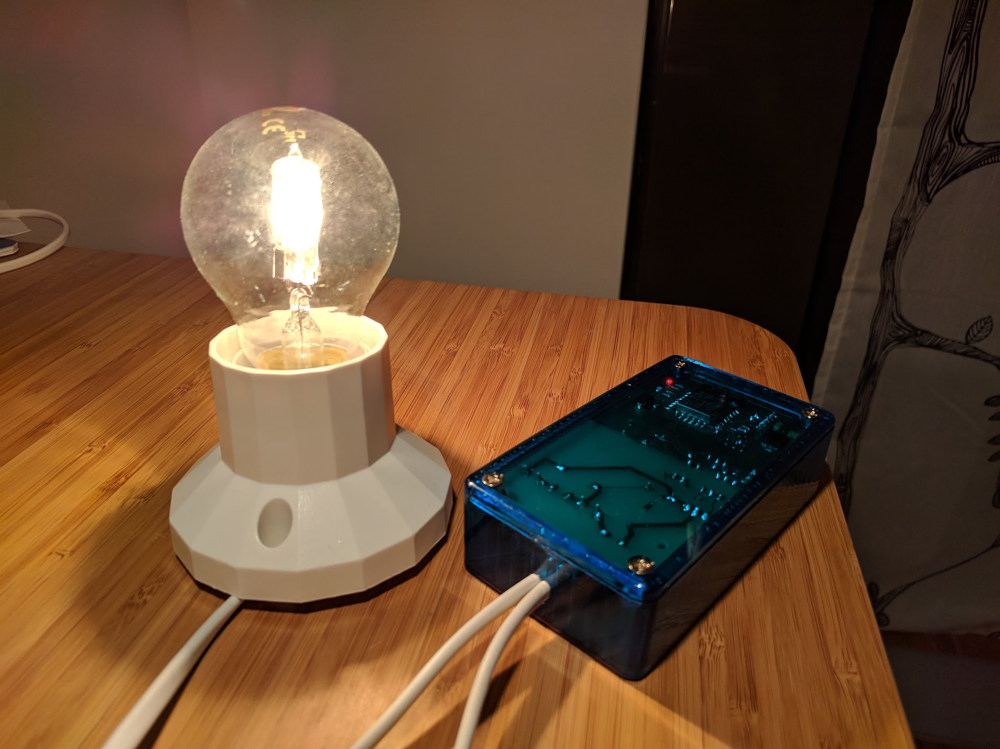
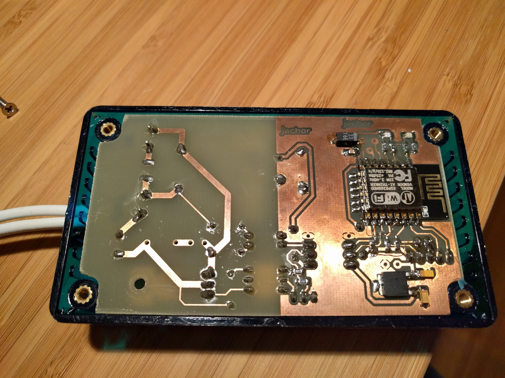

# Wifi-enabled mains powered alarm clock actuator

Simulates sunrise to make waking up a bit easier.

## Usage

Set alarm clock on your phone (in your preferred alarm clock app). Try to get
some sleep.

## Known issues

 * app background service needs to take WifiLock or schedule itself a bit smarter,
 * schematics are not accurate: I needed to change used pins on ESP8266 with
   magnet wire,
 * power (3.3V) on device is not as clean as it should be,
 * it could be at least a bit less ugly.

## Components:

### Hardware

 * basic triac-based dimmer circuit,
 * galvanically separated logic/mains parts,
 * uses Chromecast PSU for power,
 * designed around Conrad project box dimensions.

See [schematics](hardware/schematic.pdf), [pcb](hardware/pcb.pdf).

### Firmware (running on ESP8266)

Implements pulse width modulation (PWM) synchronized to mains zero-crossings. 
Runs mDNS responder + HTTP server for communication. Keeps list of values
written with expiration timestamps for each `client_id`. That enables it to
handle problems such as intermittent connection to Mobile device and multiple
devices present.

See [source](https://github.com/jachor/budzik/tree/master/esp).

Built using [PlatformIO](https://platformio.org/), uses Arduino-style
libraries.

### Software (Android)

Has minimal settings and manual control activity:

 * scanning network for device + picking one,
 * manual control of light intensity,
 * some settings for enabling/configuring simulated sunrise.
 
Runs service in background reacting to next alarm changes. Schedules itself
passively (no need for app to run) set time before next alarm clock. When there
is an alarm set close to current time runs as foreground service. Displays
notification with status. When notification is clicked launches settings app,
also shows action button in notification to kill light immediately ;)

See [source](https://github.com/jachor/budzik/tree/master/android/budzik/app/src/main/java/pl/jachor/budzik).

Written in Kotlin with Dagger for dependency injection.

